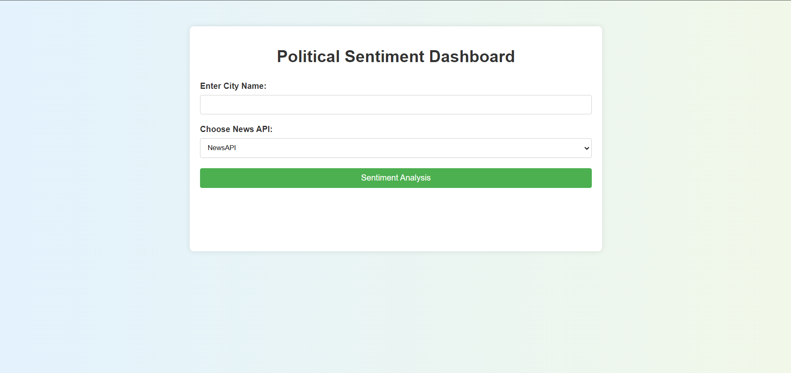
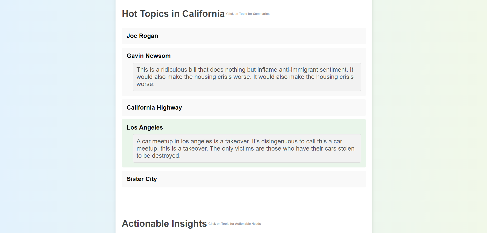
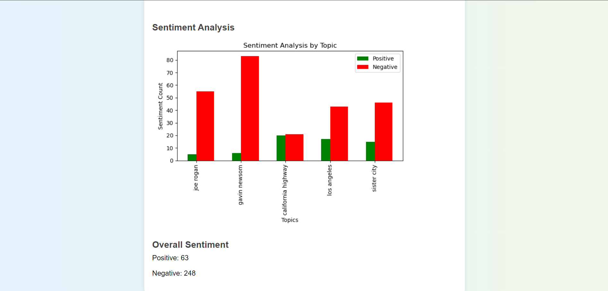

# __Political Sentiment Dashboard__
#### __ML Experts Internship Evaluation Task: Sarin Sthapit__
##
### __Approach__
##### 1. __Fetching News Articles and Top 5 Hot Topics__
###### Two APIs, News API and GNews API were used to extract news articles based on the names of cities that were entered by the user. A URL is constructed to query News API for articles related to the specified city. Then, similar topics are filtered out, and unique topics are retained using _SequenceMatcher_. Count occurences of keywords are used to find the most common phrases for specified number of topics. N-Grams mechanism is used to extract the hot topics while preserbing the context of words by considering them in combination rather than treating them as isolated units. This also helps to provide a richer representation of the text data. 
##
##### 2. __Extracting Discussion from Reddit__ 
###### Discussions are collected in _.json_ file from Reddit for specific topics using _praw_ library using Reddit's credentials. Here, all Reddit's all subreddit posts are searched for related contents along with their score and number of comments. The _JSON_ file stores the Reddit discussions into a dictionary where topics are associated with its gathered discussions, comments, and scores. 
##
##### 3. __Summarization of Discussions__
###### For the summarization of discussions, a pre-trained T5 LLM model is loaded to handle the text reduction tasks, which uses the collection of discussions stored in JSON file. To manage the length, the content is broken into smaller chunks in order to fit the model's input limits. Each chunk is then passed through the T5 Summarization model to generate concise summaries of discussions. The output is further refined by the same model to improve the clarity and precision, for a clear and condensed version of discussions. The refined summaries are stored for each topic, enabling an efficient way to extract key points from extensive discussions. Several other Transformers models were tried but T5 model was eventually selected due to small size resulting in less time required to run the project. OpenAI was also explored but it was limited to a certain number of tries in a day, which conflicted while testing the project.
##
##### 4. __Sentiment Analysis__
###### For Sentiment Analysis, a _DistilBERT_-based model is used for sentiment classification. Once the discussions are summarized, the same text from JSON file is broken into chunks again for sentiment processing. Each chunk is analyzed for positive or negative sentiments, and the results are aggreagated for each discussion topic. The sentiments are then categorized into positives and negatives. A final tally of the sentiment counts across all discussion is made, giving a comprehensive view of how people feel about each topic. These results are visualized in a bar chart, comparing the number of positive and negative sentiments for each topic, providing deeper insights.
##
##### 5. __Frontend Development using Flask__
###### The frontend of the project is developed using Flask where the functions from Tasks 1, 2, and 3 are called from _app.py_ and are rendered using _index.html_ file and _style.css_ file.

#
#
### __Installation Instructions__
###### 1. First of all, clone the repository: _git clone https://github.com/SarinSthapit/MLE-Intern-Task.git_ 
###### 2. Enter into the local repository: _cd MLE-Intern-Task_
###### 3. Create a Conda environment: _conda create --name new_env python=3.9.18_
###### 4. Activate the Conda environment: _conda activate new_env_
###### 5. Install dependencies: _conda env create -f environment.yml_ OR _pip istall -r requirements.txt_
###### 6. Run the command in terminal: _python -m src.app_
###### 7. The project runs in: _http://127.0.0.1:5000_
###### 8. The name of the city needs to be typed and the preferred news portal has to be selected.
